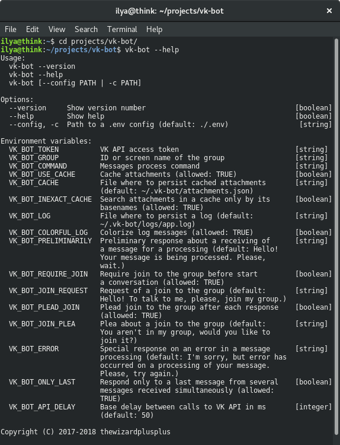
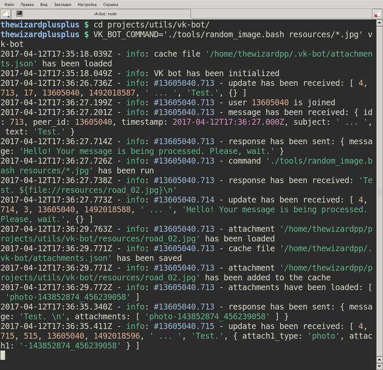
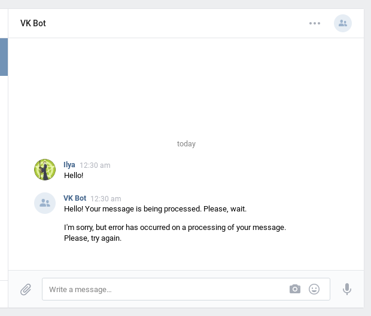

# VK Bot

Extendable [VK](http://vk.com/) group bot.

## Features

- listen inbox messages via [the long polling technology](https://vk.com/dev/using_longpoll);
- process messages by the specified outer command:
  - serialize a message object (see below for details) to the JSON format;
- special responses:
  - join to the group:
    - request of it before a start of a conversation;
    - plea about it after each response;
  - preliminary response about a receiving of a message for a processing;
  - special response on an error in a message processing;
- respond only to a last message from several messages received simultaneously;
- attachments:
  - support attachments in a response (see below for details);
  - automatically load attachments from a command response:
    - use a community mode for an attachments uploading;
  - cache loaded attachments:
    - search in a cache by:
      - attachment path;
      - attachment basename.

## Installation

Clone this repository:

```
$ git clone https://github.com/thewizardplusplus/vk-bot.git
$ cd vk-bot
```

Install dependencies and build the project:

```
$ npm install
```

Symlink the package folder:

```
$ sudo npm link
```

## Update

Pull updates from the repository:

```
$ cd vk-bot
$ git pull --rebase origin master
```

Install new dependencies and rebuild the project:

```
$ npm install
```

Update the symlink to the package folder:

```
$ sudo npm link
```

## Usage

```
$ vk-bot --version
$ vk-bot --help
$ vk-bot [--config PATH | -c PATH]
```

Options:

- `--version` &mdash; show version number;
- `--help` &mdash; show help;
- `--config PATH`, `-c PATH` &mdash; path to a `.env` config (default: `./.env`).

Environment variables:

- `VK_BOT_TOKEN` &mdash; VK API access token;
- `VK_BOT_GROUP` &mdash; ID or screen name of the group;
- `VK_BOT_COMMAND` &mdash; messages process command;
- `VK_BOT_USE_CACHE` &mdash; cache attachments (allowed: `TRUE`);
- `VK_BOT_CACHE` &mdash; file where to persist cached attachments (default: `~/.vk-bot/attachments.json`);
- `VK_BOT_INEXACT_CACHE` &mdash; search attachments in a cache only by its basenames (allowed: `TRUE`);
- `VK_BOT_LOG` &mdash; file where to persist a log (default: `~/.vk-bot/logs/app.log`);
- `VK_BOT_COLORFUL_LOG` &mdash; colorize log messages (allowed: `TRUE`);
- `VK_BOT_PRELIMINARILY` &mdash; preliminary response about a receiving of a message for a processing (default: `Hello! Your message is being processed. Please, wait.`);
- `VK_BOT_REQUIRE_JOIN` &mdash; require join to the group before start a conversation (allowed: `TRUE`);
- `VK_BOT_JOIN_REQUEST` &mdash; request of a join to the group (default: `Hello! To talk to me, please, join my group.`);
- `VK_BOT_PLEAD_JOIN` &mdash; plead join to the group after each response (allowed: `TRUE`);
- `VK_BOT_JOIN_PLEA` &mdash; plea about a join to the group (default: `You aren't in my group, would you like to join it?`);
- `VK_BOT_ERROR` &mdash; special response on an error in a message processing (default: `I'm sorry, but error has occurred on a processing of your message. Please, try again.`);
- `VK_BOT_ONLY_LAST` &mdash; respond only to a last message from several messages received simultaneously (allowed: `TRUE`);
- `VK_BOT_API_DELAY` &mdash; base delay between calls to VK API in ms (default: 50).

Environment variables can be specified in a `.env` config in the format:

```
NAME_1=value_1
NAME_2=value_2
...
```

See details about the format: https://github.com/motdotla/dotenv#rules.

A `.env` config will never modify any environment variables that have already been set.

## Message object

Message object in the JSON Schema format: [docs/message.json](docs/message.json).

## Attachments

```regex
/\${file:\/\/(?P<path>[^{}]+)}/
```

Path may be:

- absolute;
- relative to a current working directory.

## Screenshots



Help message



Messages processing


Conversation with the bot


Request of a join to the group


Plea about a join to the group



Error in a message processing

## License

The MIT License (MIT)

Copyright &copy; 2017-2018 thewizardplusplus
